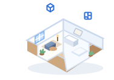
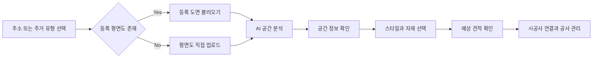
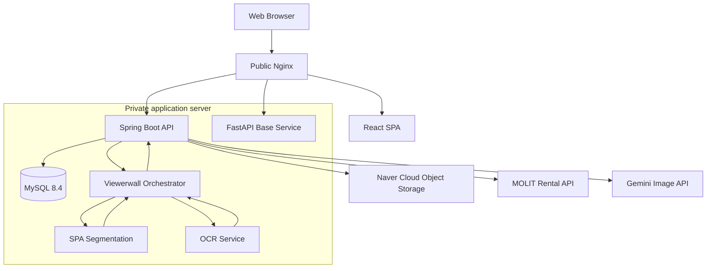

<div align="center">



# SpaceUP

### 평면도에서 시작하는 AI 인테리어 의사결정 플랫폼

주소 검색 또는 평면도 업로드부터 공간 분석, 인테리어 시뮬레이션,
예상 견적과 시공사 연결까지 하나의 흐름으로 제공합니다.

[](https://spaceup.duckdns.org/)
[](https://github.com/ho-do99/SpaceUP)

<br />


</div>

---

## About SpaceUP

인테리어를 시작할 때 사용자는 도면 해석, 공사 범위 결정, 자재 선택,
견적 비교를 각각 다른 곳에서 해결해야 합니다. SpaceUP은 이 과정을
**주거 공간 데이터와 AI 분석을 중심으로 연결**하는 것을 목표로 합니다.

- **임대인·사용자:** 주소 또는 평면도로 공간을 분석하고 원하는 공사 범위를 선택합니다.
- **시공사:** 의뢰 도면과 현장 정보를 확인하고 견적, 채팅, 공사 진행을 관리합니다.
- **플랫폼:** 공간 분석 결과를 견적과 시공사 추천에 연결하고 진행 상태를 관리합니다.

## Core Experience



| 영역 | 제공 경험 | 현재 상태 |
| --- | --- | --- |
| 공간 분석 | 주소 검색, 평면도 업로드, 방별 공간 정보 확인 | API 통합 진행 중 |
| 인테리어 설계 | 스타일·바닥·벽지·조명 선택, 이미지 시뮬레이션 | 부분 연동 |
| 견적 요청 | 분석 결과 기반 공사 범위와 견적 요청 관리 | 부분 연동 |
| 시공사 포털 | 의뢰, 견적, 채팅, 방문, 공사, 리뷰, 정산 화면 | 부분 연동 |
| 주택 리포트 | 분석·시공 데이터를 활용한 가치 리포트 | 개발 중 |

> 이 저장소는 현재 통합 개발 단계입니다. 화면이 구현되어 있어도 일부 기능은
> Mock 데이터 또는 외부 서비스 연결을 사용하므로, 위 표에서 연동 상태를 구분합니다.

## Architecture



사용자 요청은 Nginx를 통해 프론트엔드 또는 백엔드로 전달됩니다. 일반 AI 상태
엔드포인트를 제공하는 FastAPI 기본 서비스와 실제 평면도 분석을 조율하는
`viewerwall`은 별도 서비스이며, `viewerwall`이 공간 분할 SPA와 OCR을 조합합니다.

## Tech Stack

### Frontend


- React와 TypeScript로 사용자·시공사 워크플로를 분리해 구성합니다.
- Vite 기반 개발 환경과 Vitest·Testing Library로 주요 UI 및 API 계약을 검증합니다.
- Tailwind CSS로 모바일 중심 화면과 공통 컴포넌트 스타일을 관리합니다.

### Backend


- Spring Boot 멀티 도메인 구조로 회원, 의뢰, 분석, 견적, 채팅, 프로젝트를 관리합니다.
- Spring Security와 JWT로 역할 기반 인증을 처리합니다.
- JPA와 Flyway로 애플리케이션 모델과 MySQL 스키마 변경 이력을 관리합니다.

### AI


- FastAPI 서비스가 평면도 분석 요청과 AI 서비스 간 통신을 담당합니다.
- SPA 기반 공간 분할과 OCR 결과를 결합해 방 이름과 면적 정보를 생성합니다.

### Database & Infrastructure


- MySQL 데이터베이스와 Flyway 스키마 반영 환경을 관리합니다.
- 서비스를 Naver Cloud 서버에 배포하고 도면 이미지를 Object Storage에 보관합니다.
- Docker Compose로 웹, API, 데이터베이스와 AI 서비스를 구성합니다.
- Nginx가 TLS 종료와 프론트엔드·백엔드·AI 리버스 프록시를 담당합니다.
- GitHub Actions가 `main` 브랜치 배포를 자동화합니다.

## Repository

```text
SpaceUP/
├── frontend/                 # React + TypeScript 사용자·시공사 웹
├── backend/                  # Spring Boot 도메인 API
├── ai/
│   ├── app/                  # 기본 FastAPI 서비스
│   ├── viewer3d/             # 평면도 분석 오케스트레이터
│   ├── spa/                  # 공간 분할 모델 서비스
│   ├── ocr/                  # 도면 문자 인식 서비스
│   └── model_weights/        # Git LFS 기반 모델 가중치
├── database/                 # MySQL 초기 데이터
├── nginx/                    # 로컬·배포 리버스 프록시 설정
├── storage/                  # 로컬 런타임 파일 저장소
├── docker-compose.local.yml  # 소스 마운트 기반 로컬 개발
└── docker-compose.dev.yml    # 통합 개발 서버 배포
```

## Getting Started

### Prerequisites

- Node.js `22.22.2+`
- Java `21`
- Python `3.11`
- Docker Desktop 또는 Docker Engine + Docker Compose
- Git LFS
- MySQL `8.x` 또는 접근 가능한 개발 데이터베이스

### Clone

```bash
git clone https://github.com/ho-do99/SpaceUP.git
cd SpaceUP

git lfs install
git lfs pull
cp .env.example .env.local
```

`.env.local`에는 실제 비밀값을 커밋하지 마세요. 로컬 Compose는 MySQL을 직접
생성하지 않으므로 `DB_HOST`를 컨테이너에서 접근 가능한 MySQL 주소로 설정해야
합니다. macOS와 Windows에서 호스트 MySQL을 사용할 경우 일반적으로
`host.docker.internal`을 사용할 수 있습니다.

### Run Local Services

```bash
docker compose \
  --env-file .env.local \
  -f docker-compose.local.yml \
  up --build ai backend frontend
```

| Service | URL |
| --- | --- |
| Frontend | `http://localhost:5173` |
| Backend API | `http://localhost:8090` |
| Backend Health | `http://localhost:8090/actuator/health` |
| Base AI Health | `http://localhost:8000/health` |

`nginx`까지 실행하려면 로컬 인증서가 추가로 필요합니다. 실제 SPA/OCR 평면도
분석 스택은 모델 가중치와 OCR 기반 이미지가 준비된 통합 개발 환경에서 실행합니다.

## Environment

| Group | Main variables | Purpose |
| --- | --- | --- |
| Database | `DB_HOST`, `DB_PORT`, `DB_NAME`, `DB_USER`, `DB_PASSWORD` | Spring Boot MySQL 연결 |
| Authentication | `JWT_SECRET`, `JWT_EXPIRATION_MS` | JWT 서명과 만료 시간 |
| Web | `APP_CORS_ALLOWED_ORIGINS`, `VITE_API_BASE_URL` | CORS와 API 경로 |
| Floor plan AI | `AI_FLOORPLAN_BASE_URL` | Backend에서 viewerwall 연결 |
| Object Storage | `NCP_OBJECT_STORAGE_*` | 도면·이미지 객체 저장소 |
| External APIs | `MOLIT_RENT_API_SERVICE_KEY`, `GEMINI_API_KEY` | 주소 데이터와 이미지 생성 |

기본 형식은 [`.env.example`](./.env.example)을 참고하세요. 운영 비밀값은 저장소가
아닌 서버 전용 Secret 또는 GitHub Actions Secrets로 주입합니다.

## Verification

```bash
# Frontend
cd frontend
npm ci
npm run test:run
npm run lint
npm run build
```

```bash
# Backend
cd backend
./gradlew test
```

```bash
# Base AI service
cd ai
python3.11 -m venv .venv
source .venv/bin/activate
python -m pip install -r requirements.txt
python -m pytest tests -q
```

기본 AI 테스트는 `ai/app`의 API 계약을 검증합니다. 실제 `viewerwall → SPA/OCR`
추론과 Object Storage를 포함한 통합 동작은 별도의 E2E 검증이 필요합니다.

## Team

SpaceUP은 기획부터 서비스 구현과 클라우드 운영까지 다섯 역할이 협업합니다.

| Role | Responsibility |
| --- | --- |
| PM | 서비스 기획, 요구사항·정책 결정, 일정과 통합 우선순위 관리 |
| Frontend | 사용자·시공사 UX 구현, React 상태 관리와 API 연동 |
| Backend | 도메인 API, 인증·인가, 비즈니스 로직과 데이터 영속화 |
| AI | 평면도 공간 분할·OCR, 분석 파이프라인과 모델 서빙 |
| DB & Infra | MySQL, Naver Cloud, Object Storage, Docker·Nginx, 배포 자동화 |

## Collaboration

```text
main       배포 기준
develop    기능 통합 및 E2E 검증
frontend   React 작업
backend    Spring Boot 작업
ai         AI 모델·분석 파이프라인 작업
infra      DB·Naver Cloud·배포·Docker/Nginx 작업
```

PM은 별도 기능 브랜치 대신 Issue와 Pull Request에서 요구사항·정책·우선순위를
관리합니다. 각 개발 담당 브랜치는 최신 `develop`을 반영한 뒤 Pull Request로
통합합니다. `main` 병합 전에는 프론트엔드 테스트·lint·build, 백엔드 테스트,
AI API 테스트와 핵심 사용자 흐름 E2E를 함께 확인합니다.

---

<div align="center">

**SpaceUP** · 공간 데이터에서 시작하는 더 나은 인테리어 경험

</div>
